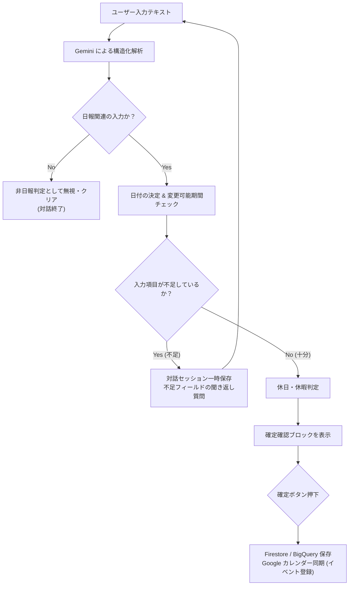
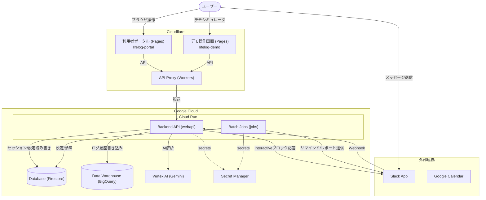
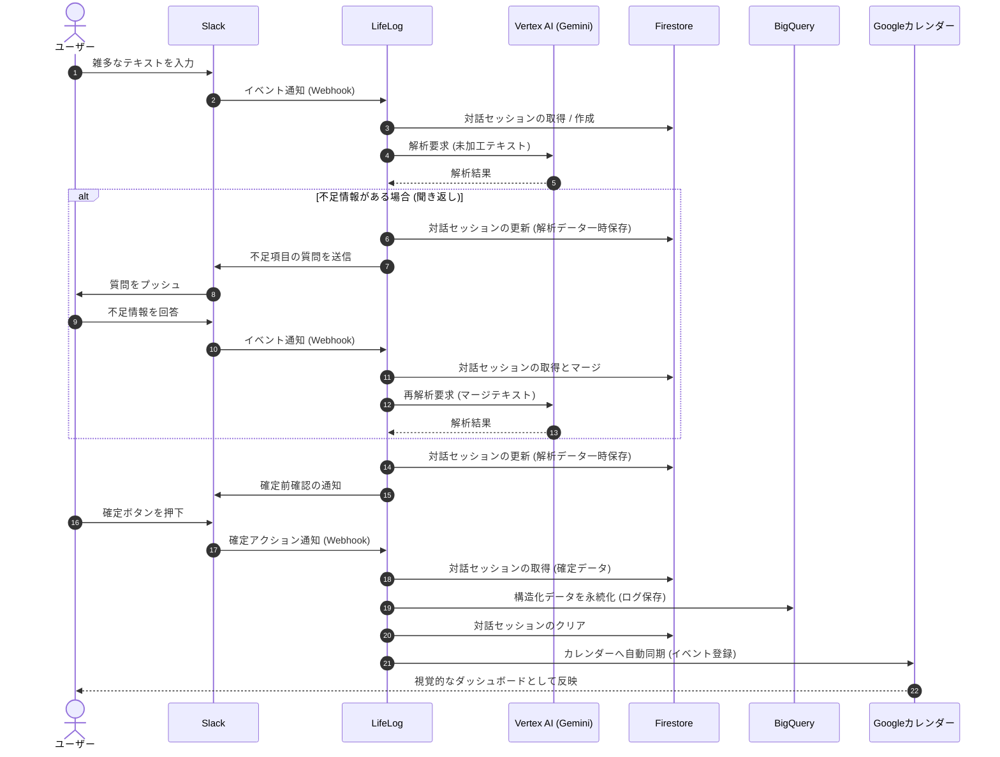
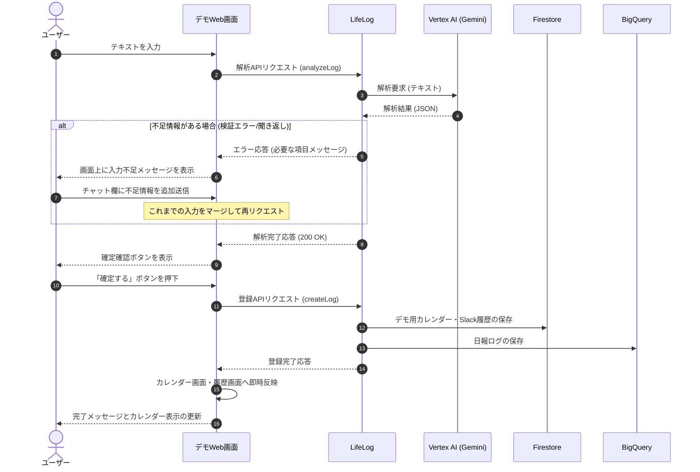

# LifeLog - AI対話型日報・日記ツール

> [!WARNING]
> **🚧 現在開発中です**
> デモ画面は公開・利用可能ですが、その他の機能（本番 Slack 連携・利用者ポータル等）は現在開発中のため利用はできません。

> 毎日の業務やプライベートの出来事を **Slack に雑多に送るだけ**。
> AI（Vertex AI Gemini）がテキストから「作業実績（日報）」「日記」「感情」「稼働時間」を自動で構造化抽出し、
> **「Google カレンダー」をそのまま視覚的ダッシュボードとして自動同期**する、完全受動型ライフログツールです。
> 本格的な本番 Slack 連携に加え、ブラウザ上で全フローを仮想体験できる「デモ画面（Web UI）」も提供しています。

---

## 1. 課題・対象ユーザー・提供価値

### 課題
毎日の日報登録や日記の記録は、メールによる報告もしくはエクセルやスプレッドシートへの入力で行うことが多く、認知負荷や心理的ハードルが高くなりがちです。<br>
また管理するのも面倒で入力漏れが多発します。

面倒だからといって先延ばしにして、後でまとめて書こうとしても、いつ何をしていたか思い出すのが困難な時もあります。

### 対象ユーザー
* 日常的に Slack を使用しており、入力にかける時間を極限まで減らしたいSESの人
* カレンダー上に自分の活動実績（稼働時間やタスク内容）をグラフィカルに一元管理したい方
* 感情の波やコンディションをAIに分析してもらい、働き方のバランスを改善したい方

### 提供価値
* **チャットに送るだけ**: Slack でつぶやくように「10:00〜18:30 プログラミング。疲れた」と送るだけで完了。
* **カレンダーをダッシュボード化**: 新たな管理画面を敢えて使用せず、使い慣れた Google カレンダーへ自動でドラフト/確定同期。
* **AIが不足情報を聞き返し**: 稼働時間やタスク内容が欠落している場合、Gemini が自動で不足フィールドを判断して質問します。
* **当月1日の先月更新特例**: 翌月に跨いだ直後の「1日」であれば、先月最終日などの登録忘れ分も例外的に登録・変更可能です。

---

## 2. AI受動型登録エージェントの仕組み

ユーザーの入力から日報データを生成する際、AI（Vertex AI Gemini）とシステムが連携して以下のフローを自律処理します。



### 2.1 実例: 日報の「抽出 → 聞き返し → 確定」まで自動化
**Before (ユーザーの最初の入力):**
> 開発作業を頑張った。

**エージェントの処理と対話:**
1. **解析 & 判定** — Gemini が日報関連と認識するが、「作業日」と「稼働時間」が不足していると判定。
2. **聞き返し (Slack/Demo Web)** — `「作業日と稼働時間を入力してください。何日の稼働で、何時間働きましたか？」` と質問。
3. **ユーザーの追加回答** — `今日。7.5時間働いた。`
4. **マージ & 再解析** — 前回の「開発作業」と今回の「今日」「7.5時間」をマージして再解析し、項目を完全に充足。
5. **確定前確認** — Slack の Block Kit / デモ Web UI 上に `「2026/07/04(土) 稼働時間: 7.5h の内容で登録しますか？」` を表示。
6. **確定実行** — ユーザーが確定ボタンを押下すると、Google カレンダーと BigQuery にデータが即時同期されます。

### 2.2 特例ルール: 前月日報の更新猶予期間
月が変わった直後に「先月末の日報を書き忘れていた」という事態に対応するため、**本日の日付が「1日」である場合に限り、前月（先月）の日報の登録・更新を許可**します。2日以降、または先々月以前の日付を指定した場合は、セキュリティと整合性のためブロックされます。

---

## 3. システムアーキテクチャ & データフロー

本システムは、Cloudflare Pages/Workers によるプロキシ・配信層と、Google Cloud 上のバックエンド（Cloud Run / Cloud Run Jobs）を組み合わせた構成になっています。



### 3.1 詳細データフロー（時系列シーケンス）

#### A. 本番運用フロー (Slack連携)
本番環境では、Slackをインターフェースとし、Webhookをトリガーに非同期で対話セッション管理および登録同期が行われます。



#### B. デモ画面フロー (Web UI)
デモ画面では、同期的なREST API呼び出しを通じて、対話やデモ用カレンダーへの即時反映をシミュレートします。



### 3.2 レイヤー別の構成コンポーネント

| レイヤー | サービス名 | 主な役割・機能 |
| :--- | :--- | :--- |
| **フロントエンド (Cloudflare)** | Cloudflare Pages | 一般ユーザーポータル画面 (`lifelog-portal`) およびデモ画面 (`lifelog-demo`) のホスティング |
| | Cloudflare Workers | API リクエストを Google Cloud へ中継するリバースプロキシ |
| **バックエンド (Google Cloud)** | Cloud Run Services | REST API サーバー。本番用 (`webapi`) とデモ用 (`demo-webapi`) が稼働 |
| | Cloud Run Jobs | 定期実行されるバッチ処理。リマインド (`remind-batch`) と月末振り返り (`reflection-batch`) |
| | Cloud Firestore | ユーザー設定、対話セッション情報、カレンダー予定などのドキュメント保存用DB |
| | BigQuery | ライフログ履歴の蓄積・分析用のデータウェアハウス |
| | Vertex AI (Gemini) | Slack/Webから受信した雑多なテキストから、感情、稼働、日記を構造化抽出 |
| | Secret Manager | Slack APIトークン、Google OAuthクライアント鍵などの安全な一元管理 |
| | Cloud Scheduler | 定期バッチジョブ（Cloud Run Jobs）のスケジュール起動トリガー |
| **外部サービス連携** | Slack App | ユーザーへの通知（リマインド/確認フォーム）およびメッセージ（出来事）の受信インターフェース |
| | Google カレンダー | ライフログの最終的な出力先であり、視覚的な活動ダッシュボードとして機能 |

---

## 4. 主な機能

* **Slack 対話式日報登録**:
  SlackのDM上でBotと対話するだけで、日報登録が完了。聞き返しセッション、登録内容の「確定/キャンセル」アクションを Slack Block Kit を介して実行します。
* **Google カレンダー自動同期**:
  日報確定時に、対象日のイベントタイトル（例: `[日報] 7.5h` / `[休日・休暇]`）と説明（Description: 業務内容・日記・AI感情値）を自動的にカレンダーへ反映・更新します。
* **コンディション & 感情分析**:
  Geminiにより、日記や業務内容から感情（HAPPY 🤩, NORMAL 😐, TIRED 😫, STRESSED 😡 など）を抽出し、感情の波を可視化します。
* **能動自動リマインド (Cloud Run Jobs)**:
  平日18:00以降などの設定時間において、本日の日報が未入力のユーザーに対してのみ Slack で自動通知を行います（土日祝・休暇指定日は自動でスキップ）。
* **月末振り返りレポート (Cloud Run Jobs)**:
  月末日の夜に、当月蓄積された日報ログを Vertex AI Gemini が一括分析し、月間稼働時間、トピックの集計、およびコンディションアドバイスをまとめた「振り返りレポート」を自動作成し Slack にて送信します。
* **体験型デモシミュレータ (lifelog-demo)**:
  外部の Slack や Google カレンダーとまだ連携していない段階でも、ブラウザ上で Slack風の対話やカレンダーへのマッピングを即時シミュレートして挙動を確認できます。

---

## 5. 技術構成（技術スタック）

### バックエンド (API / バッチ)
`app/lifelog` — Java + Quarkus によるREST API 及び バッチ。

| カテゴリ | 技術・ライブラリ | バージョン | 用途 |
| :--- | :--- | :--- | :--- |
| **言語** | Java | 25 | メイン開発言語 |
| **フレームワーク** | Quarkus | 3.33.2 | Web API & バッチ実行基盤 |
| **ビルド** | Gradle | — | 依存関係管理・ビルド |
| **ネイティブ化** | GraalVM / Mandrel | jdk-25 | Native Image コンパイル（本番） |
| **REST API** | quarkus-rest-jackson | — | JAX-RS による REST API エンドポイント |
| **API ドキュメント** | quarkus-smallrye-openapi | — | OpenAPI 仕様・Swagger UI の自動生成 |
| **認証** | quarkus-oidc | — | Google アカウントによる OIDC 認証・セキュアトークン |
| **バリデーション** | quarkus-hibernate-validator | — | Bean Validation を使用した入力検証 |
| **耐障害性** | quarkus-smallrye-fault-tolerance | — | 外部API呼び出しのリトライ・タイムアウト制御 |
| **AI 技術** | Google GenAI SDK (`google-genai`) | 1.58.0 | Vertex AI (gemini-2.5-flash-lite) によるコンテンツ解析 |
| **データベース** | Quarkus Google Cloud Firestore | — | ユーザー連携設定、対話セッションの永続化 |
| **DWH** | Quarkus Google Cloud BigQuery | — | ライフログ履歴データの分析蓄積 |
| **外部 API** | Google Calendar API v3 | rev20220715 | Google カレンダーのイベント登録・更新 |
| | Slack API (`slack-api-client`) | 1.38.0 | Slack メッセージ送受信・Block Kit 連携 |
| **共通ツール** | Lombok / MapStruct | 1.18.46 / 1.6.3 | ボイラープレート削減・DTO/エンティティマッピング |
| **テスト** | JUnit 5 / Mockito / AssertJ | — | 単体テスト・Mock検証・アサーション |
| | ArchUnit | 1.4.2 | アーキテクチャ構成・依存性整合テスト |
| | JaCoCo | 0.8.15 | テストカバレッジ測定（カバレッジ目標 70%） |

---

### フロントエンド (lifelog-portal / lifelog-demo)
React 19 ＋ Material UI (MUI) によるシングルページアプリケーション (SPA)。

| カテゴリ | 技術・ライブラリ | バージョン | 用途 |
| :--- | :--- | :--- | :--- |
| **言語** | TypeScript | ~6.0.2 | メイン開発言語 |
| **UIフレームワーク** | React | ^19.2.6 | コンポーネントベース UI 設計 |
| **デザインシステム** | MUI (Material UI) | ^9.1.1 | マテリアルデザインコンポーネント |
| | Emotion (MUI 依存) | ^11.14 | CSS-in-JS スタイリング |
| **ビルドツール** | Vite | ^8.0.12 | 高速ローカルサーバー・アセットバンドラ |
| **ルーティング** | React Router | ^7.17.0 | クライアントサイドの画面遷移制御 |
| **HTTP クライアント** | Axios | ^1.18.0 | バックエンド API との通信 |
| **カレンダー表示** | FullCalendar (React) | ^6.1.20 | 月間・週間カレンダー表示のシミュレーション |
| **グラフ・可視化** | Recharts | ^3.8.1 | ダッシュボード上の感情グラフ・モチベーション可視化 |
| **フォーム制御** | React Hook Form / Zod | — | ユーザーフォーム制御およびスキーマバリデーション |
| **通知トースト** | notistack | ^3.0.2 | 操作フィードバック用のトースト表示 |
| **日付操作** | Day.js | ^1.11.21 | タイムゾーン配慮の日付フォーマット・演算 |

---

## 6. インフラ・DevOps
| カテゴリ | 技術・サービス | 用途 |
| :--- | :--- | :--- |
| **フロント配信** | Cloudflare Pages | `lifelog-portal` / `lifelog-demo` 静的アセットのホスティング |
| **APIプロキシ** | Cloudflare Workers | WebAPI へのルーティング・プロキシ |
| **コンテナ実行** | Cloud Run (Services / Jobs) | APIサーバーおよびバッチジョブのサーバーレス動作 |
| **CI / CD** | GitHub Actions / Cloud Build | 自動テスト実行、コンテナイメージのビルドおよびデプロイ |
| **IaC** | Terraform | GCP および Cloudflare リソースのコード管理 (GCSリモートState) |
| **シークレット管理** | Secret Manager | Slack App トークン、Google OAuth クライアント鍵の管理 |
| **ローカル開発** | Docker Compose | Firestore/BigQuery ローカルエミュレータの立ち上げ |

---

## 7. DevOps & CI/CD
本システムは、コードの品質・セキュリティ・継続的デプロイを保証するためのフルパイプラインを構築しています。

* **IaC (Terraform) による管理**:
  `terraform/` 以下のファイルで、Cloud Run、Firestore、BigQuery、Cloud Scheduler、Secret Manager、GitHub Actions用の Workload Identity Federation (WIF) 設定までを完全にコード化。Terraform State は GCS でリモート管理しています。
* **CI パイプライン**:
  GitHub Actions (`ci.yml`) を通じて、JUnit 5 テストを実行。JaCoCo によるカバレッジ測定を行い、カバレッジが **70% を下回った場合は CI を失敗**させます。
* **CD パイプライン**:
  GitHub Actions から WIF 認証を経由して Google Cloud Build をトリガー。Quarkus Native アプリケーションを Mandrel JDK 25 を用いて Docker Native ビルドし、Artifact Registry 経由で Cloud Run Services/Jobs へデプロイを行います。
* **サプライチェーン＆静的解析**:
  `terraform-ci.yml` により、Terraform 構成ファイルの `fmt` 検証、`validate` チェックを PR 時に自動で実施します。

### 実績（数値）

| 項目 | 実績値 / 閾値 |
| :--- | :--- |
| **カバレッジゲート (JaCoCo)** | 70% 以上 (必須制限) |
| **アーキテクチャテスト (ArchUnit)** | 境界分離テストパス |
| **IaC (Terraform)** | GCP / Cloudflare 用 Terraform ファイル完全管理 |
| **デプロイパイプライン** | WIF (Workload Identity Federation) キーレス連携 |

---

## 8. ローカルセットアップ手順

### 8.1 バックエンド (Quarkus) の起動
1. [Java 25 JDK](https://adoptium.net/ja/temurin/releases?version=25&os=any&arch=any) と [Docker](https://www.docker.com/ja/) がインストールされていることを確認します。
2. ローカルの Firestore / BigQuery エミュレータを起動します。
   ```bash
   docker compose up -d
   ```
3. Cloud Firestore と BigQuery にテストデータを登録します。
   ```bash
   ./tools/seed.sh
   ```
4. Quarkus を開発者モードで起動します。
   ```bash
   ./tools/start_webapi.sh
   ```
   * API エンドポイント: `http://localhost:5000`
   * Swagger UI: `http://localhost:5000/swagger-ui/`

### 8.2 フロントエンド (React) の起動

1. [Node.js 20 LTS](https://nodejs.org/ja/download/releases/20.x) (npm) がインストールされていることを確認します。

2. アプリケーションを起動します。

**デモ画面を起動する場合:**
```bash
./tools/start_demo.sh
```
* デモ画面 URL: `http://localhost:5173`

**ポータル画面を起動する場合:**
```bash
./tools/start_portal.sh
```
* ポータル画面 URL: `http://localhost:5174`

---

## 9. 環境変数一覧 (バックエンド)

バックエンド API (Quarkus) の振る舞いは `application.yaml` または以下の環境変数でカスタマイズします。

Secret Managerのキーを参照する変数は、Secret Managerのキー名を指定します。

| 環境変数名 | 説明 | 設定例 |
| :--- | :--- | :--- |
| `QUARKUS_PROFILE` | 実行プロファイル (本番: `prod`, 開発: `dev`) | `dev` |
| `LIFELOG_DEMO_ENABLED` | デモ機能・デモ用APIの有効化フラグ | `true` / `false` |
| `GOOGLE_CLOUD_PROJECT` | 連携する Google Cloud プロジェクト ID | `lifelog-gcp-project` |
| `SLACK_BOT_TOKEN` | 本番用 Slack App の Bot ユーザー OAuth トークン | `xoxb-xxxxxxx` |
| `SLACK_SIGNING_SECRET` | Slack からの Webhook 送信検証用シークレット | `xxxxxxxxxx` |
| `GOOGLE_JAPANESE_HOLIDAY_CALENDAR_ID` | 日本の祝日カレンダーの ID (デフォルト値あり) | `ja.japanese#holiday@group.v.calendar.google.com` |
| `CRYPTO_KEY` | セッションやアクセストークンの暗号化キー | `32バイト以上のシークレットキー` |
| `GEMINI_MODEL` | Vertex AI で使用する LLM モデル名 | `gemini-2.5-flash-lite` |
